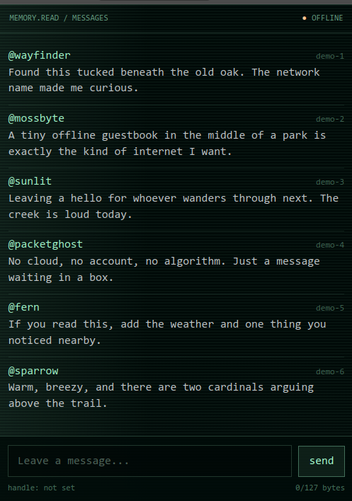

<div align="center">

# Message in a Bottle

**A tiny, offline guestbook and live chat that lives on an ESP32.**

Connect to its Wi-Fi network, leave a note, and pass it along. No internet,
account, cloud service, or app required.



[](https://platformio.org/)
[](https://wiki.seeedstudio.com/XIAO_ESP32C3_Getting_Started/)
[](LICENSE)

</div>

## What it is

Message in a Bottle turns a Seeed Studio XIAO ESP32-C3 into a self-contained
digital guestbook and local live chat. Leave notes for whoever finds the device
next, or gather nearby and use it as a shared chat room—without relying on an
internet connection. The board creates an open Wi-Fi access point named
`MESSAGE-IN-A-BOTTLE`, redirects connected devices to its captive portal, and
serves the entire experience from flash storage.

Everyone connected sees new posts within a few seconds. Messages also stay on
the device in a CRC-checked persistent ring buffer, so the conversation survives
restarts and becomes a guestbook for future visitors. The newest 1,000 messages
are retained by default; once the buffer is full, new messages replace the
oldest ones.

## How it works

```text
phone / laptop
      │
      │ Wi-Fi: MESSAGE-IN-A-BOTTLE
      ▼
XIAO ESP32-C3  ── captive DNS ──►  message.bottle
      │
      ├── web UI + JSON API
      └── LittleFS persistent ring buffer
```

- The ESP32 runs an open access point at `192.168.4.1`.
- A wildcard DNS server sends every hostname to the local captive portal.
- A dependency-free HTML/CSS/JavaScript client reads and posts messages.
- The client polls every three seconds, giving everyone connected a shared live
  conversation while deduplicating posts by message ID.
- Handles are stored only in the browser session; posted handles and messages
  are written to the device.
- Handles may contain up to 31 UTF-8 bytes and messages up to 127 UTF-8 bytes.

## Hardware and software

- [Seeed Studio XIAO ESP32-C3](https://wiki.seeedstudio.com/XIAO_ESP32C3_Getting_Started/)
- A USB-C data cable
- [PlatformIO](https://platformio.org/) (CLI or the VS Code extension)

The only firmware library dependency, ArduinoJson 7, is installed automatically
by PlatformIO.

## Build and flash

Clone the repository and enter the project directory:

```sh
git clone https://github.com/ddaeschler/message_in_a_bottle.git
cd message_in_a_bottle
```

Connect the board, then upload both the firmware and the LittleFS image:

```sh
pio run --target upload
pio run --target uploadfs
```

The `uploadfs` target automatically compresses files from `www/` into `data/`
before building the filesystem image. Re-run it whenever the web interface
changes.

To inspect startup logs:

```sh
pio device monitor --baud 115200
```

## Use it

1. Power the board.
2. Join the open Wi-Fi network `MESSAGE-IN-A-BOTTLE`.
3. Open the captive-portal prompt. If it does not appear, visit
   `http://message.bottle/` or `http://192.168.4.1/`.
4. Write a message, choose a handle, and send it into the bottle.
5. Leave it behind as a guestbook, or have others join the network and chat live.

> [!IMPORTANT]
> The access point is intentionally open and messages are visible to anyone
> nearby who connects. Treat the bottle as a public physical guestbook and chat
> room, and do not post sensitive information.

## API

The browser uses a small local JSON API:

| Method | Endpoint | Purpose |
| --- | --- | --- |
| `GET` | `/read` | Read all retained messages |
| `GET` | `/read?afterId=<id>` | Read messages newer than an ID |
| `POST` | `/write` | Store a `{ "handle", "message" }` object |

See [the API interface](doc/API_INTERFACE.md) for request and response examples.

## Project layout

```text
├── src/                 ESP32 firmware and persistent ring buffer
├── include/             C++ headers
├── www/index.html       Captive-portal interface source
├── data/index.html.gz   Generated LittleFS web asset
├── scripts/             PlatformIO asset-compression hook
├── doc/                 Screenshot and API documentation
└── platformio.ini       Board, framework, and build configuration
```

## License

Released under the [MIT License](LICENSE).
